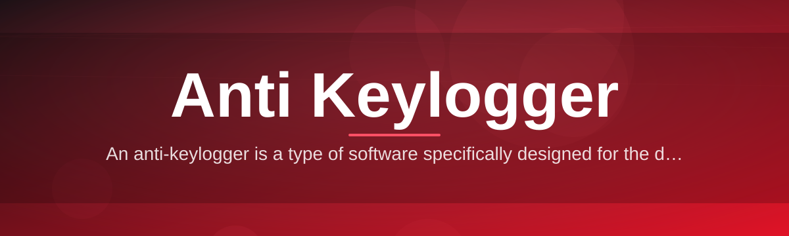
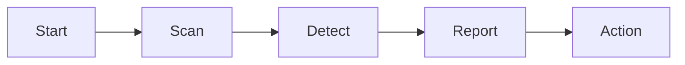

# keylogger-detector-utility 🛡️⌨️

  

*A dedicated keystroke-integrity scanner that finds and neutralizes hidden keylogging software before it finds your passwords.*

  

---

## 📖 About / Preview

<strong>Click to read the full story behind this project</strong>

 

Every keystroke you type carries value — banking credentials, private messages, work correspondence. Somewhere between your fingertips and the application receiving that input, a keylogger can quietly sit in the middle, recording everything. **keylogger-detector-utility** was built to close that gap: a focused, standalone Windows utility whose sole purpose is to identify keystroke-logging behavior on a system and give the user a clear, informed path to remove or immobilize it.

Unlike general-purpose antivirus suites that try to be everything to everyone, this tool has one job and does it thoroughly. It does not attempt to judge whether a keystroke logger is "legitimate" (parental monitoring, employee compliance tools) or "illegitimate" (surveillance without consent). Every keylogging mechanism it finds — hooks, drivers, background processes, injected modules — gets flagged the same way, because from a privacy standpoint, unauthorized keystroke capture is unauthorized keystroke capture regardless of its stated intent.

This repository grew out of a simple observation: most users have no visibility into what's silently reading their input. The project has since become a reference point for people who want a lightweight, transparent, and dependable anti-keylogger companion running alongside their existing security stack.

---

## 🔍 Overview

**keylogger-detector-utility** is a purpose-built anti-keylogger scanner for Windows. It inspects the layers of your operating system where keystroke interception commonly hides — low-level keyboard hooks, suspicious driver bindings, injected DLLs, and background processes exhibiting logging-like behavior — and surfaces them in a clean, actionable report. Where traditional antivirus software is designed to catch broad categories of malware, this utility narrows its focus entirely to keystroke logging, which lets it apply detection heuristics that general scanners simply don't prioritize.

This tool exists for a specific reason: keyloggers are frequently missed by conventional antivirus definitions because many keystroke-logging techniques overlap with legitimate system functionality (accessibility tools, remote support software, input-method editors). An anti-keylogger utility like this one treats the *behavior* — silent, persistent keystroke capture — as the signal, not the label attached to the software. That distinction is what makes dedicated keylogger detection a meaningfully different discipline from ordinary spyware removal.

It's built for privacy-conscious individuals, IT administrators auditing shared or public-facing machines, small businesses safeguarding client data, and anyone who has ever wondered "is something watching what I type?" No cloud account, no subscription, no telemetry — just a scan, a report, and a decision left in your hands.

<blockquote>

**Why it matters:** keystroke logging is one of the oldest and most effective forms of credential theft because it bypasses encryption entirely — it reads the input before encryption ever happens.

</blockquote>

---

## 🧩 What Sets It Apart

1. **Behavioral hook analysis** — rather than relying purely on signature databases, the scanner examines active keyboard hooks and flags patterns consistent with input interception, regardless of how the process disguises itself.

2. **Driver-level visibility** — many advanced keyloggers operate below user-mode, so the utility inspects loaded drivers for keystroke-adjacent capabilities that typical spyware sweeps overlook.

3. **Neutral flagging policy** — every detected keystroke logger is reported the same way, whether it was installed as monitoring software, remote-support tooling, or something dropped without consent. The decision to remove is always yours.

4. **Immobilization mode** — suspicious components can be disabled in place rather than deleted outright, useful when you want to preserve evidence or confirm a false positive before permanent removal.

5. **Lightweight footprint** — the tool ships as a standalone executable with no background services, no persistent system tray agent, and no scheduled tasks installed without your explicit consent.

6. **Human-readable reporting** — scan results are translated from raw technical detail into plain-language summaries, so non-technical users still understand what was found and why it matters.

7. **Offline-first design** — detection logic runs locally; no scan data leaves your machine unless you choose to export a report yourself.

8. **Audit trail for IT teams** — exportable logs make this a practical fit for organizations that need to document keystroke-logging findings on shared or provisioned hardware.

---

## 🚀 Getting Started

> [!TIP]
> The entire setup takes less than two minutes on a typical Windows 10 or 11 machine.

1. Visit the project landing page using the download button above or below.

2. Download the latest build for Windows.

3. Run the executable — no dependency installation, no separate runtime required.

4. Launch a scan and review the categorized results before taking any removal action.

---

## 💻 System Requirements

| Component | Requirement |
|---|---|
| Operating System | Windows 10 (64-bit) or Windows 11 |
| Architecture | x64 |
| Dependencies | None — fully standalone |
| Disk Space | Under 150 MB |
| Admin Rights | Recommended for full driver-level scanning |
| Internet | Not required after download |

  

---

## ⚙️ How It Works

The scanning pipeline is intentionally simple to reason about, which keeps false positives low and results explainable.

1. **Initialization** — the utility enumerates running processes, loaded drivers, and active keyboard hooks.

2. **Signal collection** — each candidate is scored against known keystroke-logging behaviors: hook persistence, hidden windows, unusual autorun entries.

3. **Correlation** — scores are cross-referenced to reduce noise from legitimate accessibility or remote-support software.

4. **Reporting** — findings are grouped into confidence tiers and presented in plain language.

5. **Action** — the user chooses to immobilize, remove, or ignore each flagged item.

> [!NOTE]
> Detection confidence tiers exist because keystroke-logging behavior can overlap with legitimate accessibility software — the tool favors transparency over silent auto-removal.

---

## 🧯 Troubleshooting

**Q: The scan flagged a program I installed intentionally for remote support. Is that normal?**
A: Yes. Because this is an anti-keylogger, not a general malware scanner, it flags all keystroke-capturing behavior equally, including legitimate remote-access or accessibility tools that hook the keyboard.

**Q: Why does the scan take longer on machines with many startup programs?**
A: Driver and hook enumeration scales with the number of active background processes, so systems with heavy autorun lists naturally take longer to fully analyze.

**Q: I immobilized a component and now a peripheral driver stopped responding. What happened?**
A: Some legitimate input drivers share code paths with keystroke-hook mechanisms. Use the restore option in the results panel to re-enable the affected component.

**Q: Does this tool replace my antivirus software?**
A: No. It is a specialized complement, not a replacement — run it alongside your existing antivirus or anti-spyware solution for layered protection.

**Q: Can it detect keyloggers that only activate during specific applications?**
A: Yes, application-scoped hooks are still active hooks at the OS level and will be picked up during a full scan.

**Q: Why didn't it find anything, even though I suspect a keylogger?**
A: Some hardware-based keyloggers operate entirely outside the operating system and are not detectable by any software-based scanner, including this one.

---

## 🎨 UI / UX Details

1. **Dashboard view** — a single-screen summary of scan status, threat tier counts, and last-scan timestamp.

2. **Keyboard shortcuts:**

   - `Ctrl + N` — start a new scan
   - `Ctrl + R` — generate report
   - `Ctrl + I` — immobilize selected item
   - `Esc` — cancel active scan

3. **Themes** — light, dark, and a high-contrast mode for accessibility.

4. **Settings panel** — toggle admin-level driver scanning, schedule recurring scans, and configure report export format (TXT / CSV).

> [!IMPORTANT]
> Running with administrator privileges unlocks driver-level scanning depth. Standard-user scans will still run but with reduced visibility into kernel-mode components.

---

## 🤝 Contributing & Community

> [!NOTE]
> This project has grown through the contributions of security-minded developers who care about keystroke privacy as much as we do.

1. Open an issue describing the behavior, bug, or feature idea in detail.

2. Fork the repository and work from a feature branch.

3. Submit a pull request with a clear description of what changed and why.

4. Join discussions to help triage detection edge cases and false-positive reports.

> [!WARNING]
> Please do not submit sample keylogger binaries directly into issues or pull requests — describe behavior instead, and maintainers will handle sample intake through secure channels.

---

## 📄 License

Released under the [MIT License](LICENSE), 2026.

---

## ⚠️ Disclaimer

This utility is provided for legitimate security auditing and personal privacy protection purposes only. It flags keystroke-logging behavior without distinguishing intent — users are responsible for verifying findings and complying with applicable laws before taking removal action on shared, corporate, or third-party systems. The maintainers assume no liability for misuse or for damage resulting from actions taken based on scan results.

